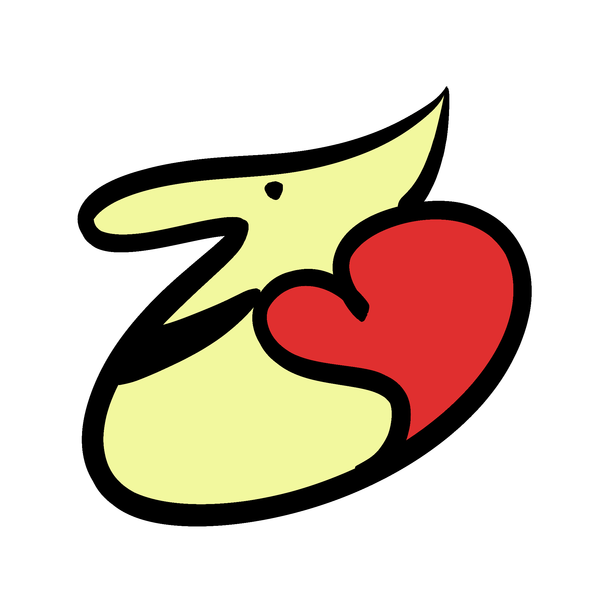

# WebJam2022

A website that allows students to borrow donated items and build long-lasting connections with one another.

Visit the website here: https://zotpals.netlify.app/

## Table of Contents
+ [Inspiration](#inspiration) 
+ [How It Works](#how-it-works) 
  + [Intro](#intro) 
  + [Home](#home) 
  + [Explore](#explore) 
  + [Product](#product) 
  + [Post](#post) 
  + [About](#about) 
+ [How We Built It](#how-we-built-it) 
+ [Challenges We Faced](#challenges-we-faced) 

## Inspiration
We are all college students and have experience the struggles of not having the neccessary funds to purchase items that we actually need in our day to day life. So, we wanted to create a platform that will address this, in hope that it will also support other students that may be going through the same experiences. We also know that building connections may be difficult and wanted to provide a new way for friendships and relationships to grow.

## How It Works
There are six pages to the website: Intro, Home, Explore, Post, Product, and About.
### Intro
Upon entering our website, the user will be greeted with a storyboard that we have created to illustrate the mission behind the project. From there, a home button will also be displayed, which will bring the user to the Home page of the website. 
### Home
At this Home page, it displays the three latest items that have been posted onto the website that is ready to be used. 
### Explore
Heading to the Explore page through the navigation bar, there will be all the donated items that have been posted and ready to be in the hands of a new owner. These items are all sorted by the date, showing the latest items at the very top and the oldest at the bottom. 
### Product
Upon clicking one of the items, it will take you to its Product page, which displays a full clear image of the item, the description which includes: name of item, the duration (how long you can borrow the item for), contact information (owner name and email), and description of the item. There is also a feature that allows you to chat with one another on that same page, and a button that will send a borrow request to the owner by sending an email with a verification link. If this verification link gets pressed, it will remove the item from the page, meaning it's currently being (used/borrowed). 
### Post
The Post Page will display a form where the user can enter all the necessary and required information about their items and contact information, which will then display their donation on the Home and Explore pages. 
### About
Lastly, the About Us Page which shows the lovely creators of this website and our email-addresses.

## How We Built It
The web app consists React, HTML, CSS, JS for the frontend. While using Express, Nodemailer, and MongoDB for the backend. We created a database using MongoDB which stores all the information that the post form provides. Through this database, we are able to get the information about the owner's contact information which we will use with nodemailer to send individual emails with verification links about the donated item.

## Challenges We Faced
There were many challenges we faced when building this website. Everything we used to create the web app was new to many of us, and we only had four days to learn all of it before submitting the project. There were many ideas that were brilliant such as creating an account system to verify each item and having a proper way to communicate with the owner through private messages, however time was very limited and we all had little to no experience, so we srapped the idea and went for the email feature. Even though there were many challenges, we were able to overcome each one and in the end completed a web app that we are proud of sharing.
